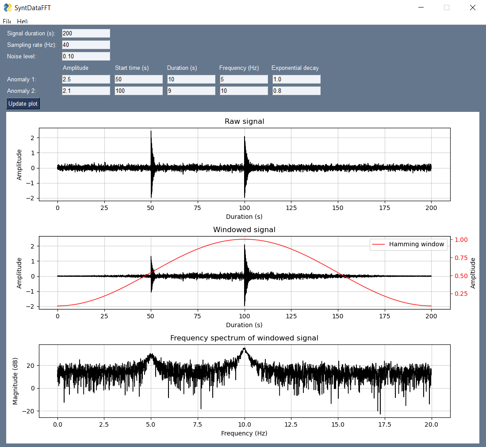

# SyntDataFFT README

- [Introduction](#introduction)
- [Terminal](#terminal)
  - [Run Application Through Python](#run-application-through-python)
  - [Create a Local Python Package](#create-a-local-python-package)
  - [Create an Executable File](#create-an-executable-file)
  - [Tests](#tests)
- [Using the Application](#using-the-application)
  - [Parameters](#parameters)
    - [Signal Parameters](#signal-parameters)
    - [Anomaly Parameters](#anomaly-parameters)
  - [Compute Fast Fourier Transform and Plot the Result](#compute-fast-fourier-transform-and-plot-the-result)

## Introduction

SyntDataFFT is a tool designed to generate synthetic raw signals based on user-defined input parameters. This application is particularly useful for mimicking accelerometer data along a 1D profile, allowing users to simulate signals containing up to two anomalies. The anomalies are represented as geometrical irregularities within the signal, providing a valuable testing ground for various applications.

After generating the synthetic raw signal, SyntDataFFT applies a Hamming window to the signal and computes the Numpy fast Fourier transform (FFT) of the windowed signal. The resulting raw signal, windowed signal, and frequency spectrum of the windowed signal are visualized in plots for easy analysis.

## Terminal

### Run application through Python
To execute the application through Python, open a terminal, navigate to the project root, and run the following command:
```
python main.py
```

### Create a Local Python Package

To build a local Python package for SyntDataFFT, open a terminal, navigate to the project root, and run the following command:
```
python setup.py sdist
```

### Create an Executable File

Build an executable (.exe) file for the application using PyInstaller. Open a terminal, navigate to the project root, and run the following command:
```
pyinstaller SyntDataFFT.spec
```

### Tests

Execute implemented tests using pytest by opening a terminal, navigating to the project root, and running:
```
pytest
```

## Use application

### Parameters

Upon application start, default values for signal and anomaly parameters are utilized. Customize the parameters according to your requirements.

* __Signal parameters__
    * __Signal duration (s)__ - Length of raw signal in seconds.
    * __Sampling rate (Hz)__ - Sampling rate of raw signal in Hertz.
    * __Noise level__ - Amplitude of normally distributed noise added to raw signal.

* __Anomaly parameters__
    * __Amplitude__ - Initial anomaly amplitude. 
    * __Start time (s)__ - Moment in time, in seconds, when anomaly is initialized.
    * __Duration (s)__ - Duration of anomaly in seconds.
    * __Frequency (Hz)__ - Frequency of anomaly in Hertz.
    * __Exponential decay__ - Magnitude of exponential decay applied to anomaly at anomaly initialization.


### Compute fast Fourier transform and plot the result

To compute the FFT of the raw signal and visualize the plots, press the ```Update plot``` button.

Feel free to explore and experiment with different parameter settings to generate and analyze synthetic signals effectively.



